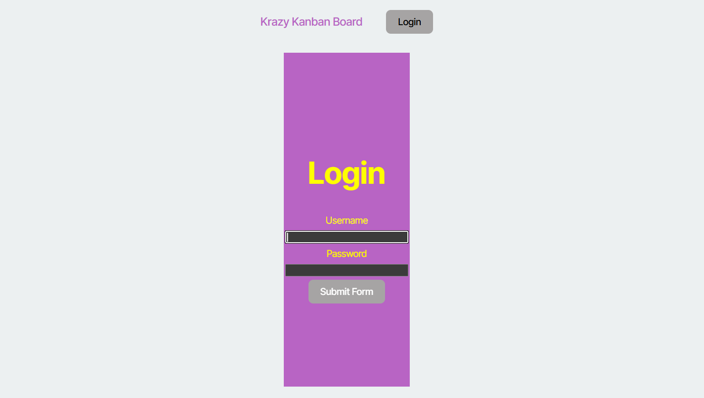
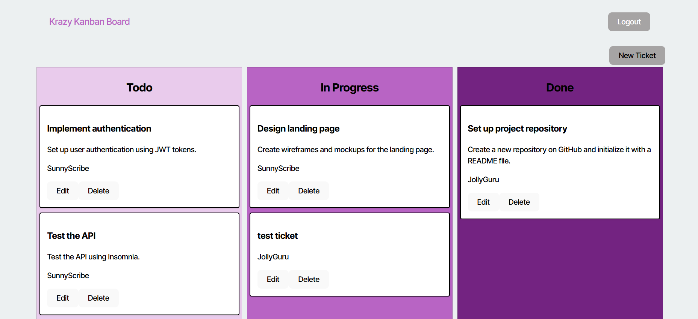
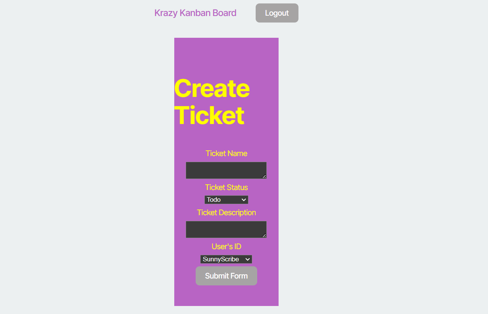

# Kanban Board

## Description

For this application, we have created a user based Kanban board. When loading the website, the user is asked to login in to create and view tickets. In the top right corner there is a login button which opens a login form. If the login form is entered with a valid user and that user's password, the user is logged in to see the created Kanban tickets. New tickets can be created by clicking the new ticket button in the top right corner. If the new ticket button is click, a new ticket form is opened, where the user can enter the ticket name, the ticket status, the tickets descriptions, and the user the ticket is associated to.

## Installation

The website is deployed at https://kanbanboard-cljj.onrender.com/. 
If you are testing locally, run the commands "npm run build" and "npm run start:dev" to test the website.

## Usage

When loading the page, the user is directed to the page above. By clicking the login button in the top right corner, the user is forwarded to the login subpage form.  

After clicking the login button, the login form subpage is loaded. Here, the user enters its username and password in the specified form locations. If the username is a valid username in the database, and the password matches the associated password in the database, the user is logged in to view the Kanban cards  

After completing a valid login form, the user is redirected back to the homepage. Now logged in, the Kanban cards are now shown to the user. If the user wants to create a new Kanban card, the "new ticket" button can be clicked in the top right corner. 
  

If the "new ticket" button is clicked, the user is redirected to the create ticket subpage that contains a form. In the form the user can specify the ticket's name, specify the status to todo, in progress, or done, give a description the ticket, and assign the ticket to a specific user in the dropdown menu. Once the form has been submitted, the user is redirected back to the homepage, with the newly created card seen in its specified status column.
## Credits

Vijay Natarajan (github.com/santoshalper)